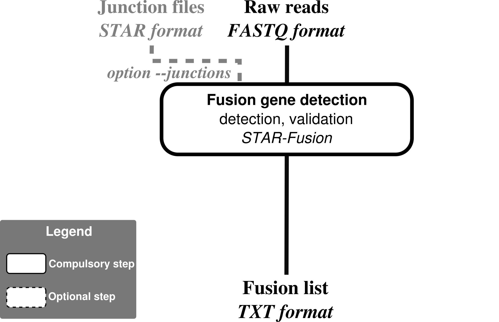
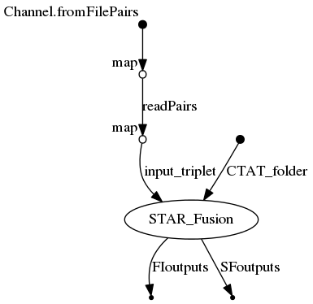

# RNAseq-fusion-nf

## Fusion-genes discovery from RNAseq data using STAR-Fusion

[](https://circleci.com/gh/IARCbioinfo/RNAseq-fusion-nf)
[](https://hub.docker.com/r/trinityctat/starfusion/)
<!---[](https://singularity-hub.org/collections/1404)--->
<!---[](https://zenodo.org/badge/latestdoi/94193130)--->



## Description
Performs Fusion-gene discovery from junction reads identified by STAR during alignment. See citation of STAR-Fusion below.

## Dependencies

1. Nextflow : for common installation procedures see the [IARC-nf](https://github.com/IARCbioinfo/IARC-nf) repository.
2. [STAR-Fusion](https://github.com/STAR-Fusion/STAR-Fusion/wiki) 

In addition, STAR-Fusion requires a [CTAT bundle](https://data.broadinstitute.org/Trinity/CTAT_RESOURCE_LIB/) with reference genome and annotations.

**A conda receipe, and docker and singularity containers are available with all the tools needed to run the pipeline (see "Usage")**

## Input
  | Type      | Description     |
  |-----------|---------------|
  | input_folder    | Folder containing fastq files and STAR junction files |

  Specify the test files location

## Parameters

  * #### Mandatory
| Name      | Example value | Description     |
|-----------|---------------|-----------------|
| --CTAT_folder   |. | Folder with STAR-Fusion bundle (CTAT) |


  * #### Optional
| Name      | Default value | Description     |
|-----------|---------------|-----------------|
| --output_folder   |   results_fusion | Output folder |
| --fastq_ext       |   fq.gz    |            Extension of fastq files |
| --suffix1         |  _1 |   Suffix of 1st element of fastq files pair |
| --suffix2         |  _2 |     Suffix of 2nd element of fastq files pair |
| --junction_suffix | Chimeric.SJ.out.junction |       Suffix of STAR chimeric junction files |
| --starfusion_path |  /usr/local/src/STAR-Fusion/STAR-Fusion | Path to STAR-fusion executable; note that the default is set to the location in the singularity container |
| --cpu             |  2 |         Number of cpu used by bwa mem and sambamba |
| --mem             |  2 |   Size of memory used for mapping (in GB)|


  * #### Flags

Flags are special parameters without value.

| Name      | Description     |
|-----------|-----------------|
| --junctions | Option to use STAR junction files already generated |
| --help    | Display help |


## Usage
  ```
  nextflow run iarcbioinfo/RNAseq-fusion-nf -r v1.0 -profile singularity  --input_folder input --CTAT_folder CTAT --output_folder output
  ```
  
To run the pipeline without singularity just remove "-profile singularity"; you can also directly download a singularity image at https://data.broadinstitute.org/Trinity/CTAT_SINGULARITY/STAR-Fusion/ using the command `singularity pull https://data.broadinstitute.org/Trinity/CTAT_SINGULARITY/STAR-Fusion/star-fusion.v1.9.0.simg`. Alternatively, one can run the pipeline using a docker container (-profile docker) the conda receipe containing all required dependencies (-profile conda).

## Output
  | Type      | Description     |
  |-----------|---------------|
  | output   | Folder with fusion genes file |


<!--- ## Detailed description (optional section) --->

## Directed Acyclic Graph
[](http://htmlpreview.github.io/?https://github.com/IARCbioinfo/RNAseq-fusion-nf/blob/master/dag.html)

## Contributions

  | Name      | Email | Description     |
  |-----------|---------------|-----------------|
  | Nicolas Alcala    |  alcalan@fellows.iarc.fr | Developer to contact for support |

## References
Haas, B. J., Dobin, A., Li, B., Stransky, N., Pochet, N., & Regev, A. (2019). Accuracy assessment of fusion transcript detection via read-mapping and de novo fusion transcript assembly-based methods. Genome biology, 20(1), 213.


<!--- ## FAQ (optional)--->
